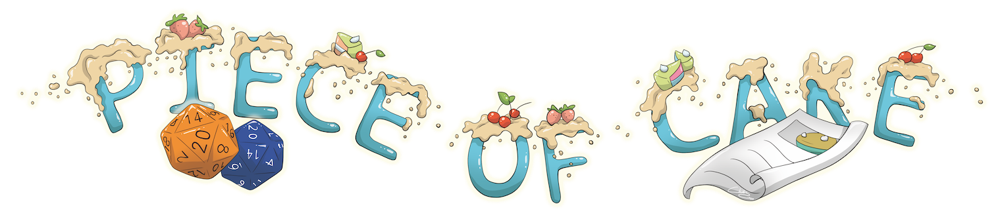
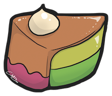

# Piece of Cake - The Security Awareness Tabletop Game

Piece of Cake is a security awareness table top RPG adventure. The players plan and execute a heist in order to steal back their secret cake recipe and prevent the rival bakery from ousting them from the market.

During the game, players apply various social engineering and physical pen testing techniques such as impersonation, tailgating, dumpster diving etc.
By actively using these techiques the players learn to think like an attacker, increasing their ability to spot and defend against such attacks.

## Getting started

In order to play the game you need:

 * A game master (GM), the person who directs the story. In the best case, this person is already familiar with GM'ing table top RPG games  and has a knowledge of various security topics such as social engineering.
 * The story book ([ODT](https://gitlab.switch.ch/security-awareness/piece-of-cake/-/tree/main/storybook) [PDF](https://gitlab.switch.ch/security-awareness/piece-of-cake/-/jobs/artifacts/main/browse/public?job=build-pdf) )
 * The character sheets
 * A printout of the map (players can discover this during the game)
 * A printout of the secret cake recipe (and if you are a really nice GM: bake the actual cake and bring it to the session to be consumed during the debriefing )
 * 3-5 players, each picking one of the character sheets
 * Dice ( preferably 20-sided dice, but other dice will do as well)

 In a typical game session...

  * The game master provides a short intro how the game is played and a short intro about common social engineering techniques
  * The players introduce their characters to each other
  * The game master sets the scene according to the storybook
  * During the 1.5-2 hours of play time, the characters steal back the secret cake recipe
  * In a short debriefing the GM provides a short recap of the social engineering techniques that were used during the game
  * Everyone eats :cake:

## Game rules

### The game loop

Like with any other known tabletop RPG, in Piece of Cake the Game master and players tell a story together, using the following simple game loop:

 1. The game master describes the current scene. For example where the players are, what they can see, what other NPC (non player characters) are nearby etc.
 1. The players decide what they want to do next (Investigate something, go somewhere, talk to someone, ... )
 1. The game master decides, if this decision leads to a "fateful situation" and requires a dice roll (see below) 
 1. The gamemaster considers how the game world reacts to the decision (or outcome of the fateful situation) and then the loop starts again.

### Fateful situations: Decisions -> Consequences

There will often be situations where there is some sort of luck involved, usually because players want to do something that might potentially fail ("I will try to convice John to let me into Jennys office"). We call these "fateful situations"(FS). Every FS is resolved by a dice bound to one of the characters talents:

 * **Intelligence** (searching & finding things, knowing things, ..)
 * **Charisma** ( befriend, deception, persuasion, ...)
 * **Athletics** ( strength, jumping, climbing, ... )
 * **Nerd** ( network sniffing, hacking, lock picking, ... )

The player rolls the 20-sided die and adds the talent bonus (or malus). If the final result is higher or equal to a target value(suggested in the story book or determined by the GM), then the situation resolves favourable to the player's intention. If the result is lower, the GM decides the unfortunate consequences.

| Chance of success | Suggested target value |
|-------------------|------------------------|
| high              | 10                     |
| medium            | 14                     |
| low               | 17                     |
| very low          | 20                     |

Example:

A player wants to convince John to let his character Margrith into Jenny's office. The GM decides this is a FS wich requires charisma, and a target value of 13:

* Player(Margrith): "I want to convice John to let me into Jenny's office by claiming I need to clean her aquarium!"
* Game master: *decides that this is a fateful situation based on charisma, target value 13* -  "Roll on charisma!"
* Player: *rolls the D20, with a result of 9. Because Margrith has a charisma bonus of +6, the total value is 15, which is higher than 13*
* Game master: "That is a success! John grabs the key from the small box on the wall and walks you over to Jenny's office and lets you in."

If you don't have 20-sided dice, you could also use simple six sided dice and let the player roll three times and add the numbers.

### Ending the game

 * After about 1.5 hours of playtime, the characters have hopefully found their way to the safe (if you're running out of time, the GM can of course place the safe at a different place than suggested in the book...)
 * Let the players finish the story ("we're replacing the stolen recipe with a fake, run out of the building as fast as we can and have a big party back home!")
 * Make a short debriefing. What security techniques did they use, maybe without even realizing? You'll find examples in the story book.
 * Eat cake!

## Is everything here really free to copy and use?

Media content in this repository is licensed under the creative commons [CC-BY-SA 4.0 license](https://gitlab.switch.ch/security-awareness/piece-of-cake/-/blob/main/LICENSE). This means you are allowed to copy and adapt the files to your needs. You may use this material commercially as well but please note that under this license the original authors should be credited and the modified files should be made available unter the same license terms (SA=share alike)

The free material includes:

 * The [storybook](https://gitlab.switch.ch/security-awareness/piece-of-cake/-/tree/main/storybook)
 * [Character sheets](https://gitlab.switch.ch/security-awareness/piece-of-cake/-/tree/main/characters)
 * [Game map](https://gitlab.switch.ch/security-awareness/piece-of-cake/-/tree/main/maps)
 * [The secret cake recipe](https://gitlab.switch.ch/security-awareness/piece-of-cake/-/tree/main/secret%20recipe)
 * [Illustrations](https://gitlab.switch.ch/security-awareness/piece-of-cake/-/tree/main/images)

To embed this game into a full [security awareness experience](https://www.switch.ch/security/info/switch-security-awareness-adventures/piece-of-cake/), SWITCH offers additional items and services which do not fall under this license:

 * intro presentation about the security topics used in this game
 * advertising flyer
 * hint flyer
 * trainings: security awareness train the trainer / tabletop RPG game mastering

## Authors and acknowledgment

*Piece of Cake* was originally created in the 2019 SWITCH open source security tools hackathon.

Idea and production:

 * Jessica Schumacher
 * Vanessa Procacci
 * Katja Dörlemann
 * Sandra Helfenstein
 * Frank Hauser
 * Oli Schacher

Illustrations by Diana Bethmann aka [Chibs](https://www.chibs.ch/)

French translation kindly provided by [BELNET](https://www.belnet.be/)

Swedish translation kindly provided by [SUNET](https://sunet.se/)

